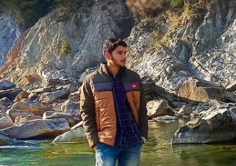

<!doctype html>
<html>
<head>
  <meta charset="UTF-8">
  <meta name="viewport" content="width=device-width, initial-scale=1.0">
  
  
  
</head>
<body>
    
  

    <!-- ... -->
    <header class="text-gray-600 body-font">
        

          <a class="flex title-font font-medium items-center text-gray-900 mb-4 md:mb-0">
            <svg xmlns="http://www.w3.org/2000/svg" fill="none" stroke="currentColor" stroke-linecap="round" stroke-linejoin="round" stroke-width="2" class="w-10 h-10 text-white p-2 bg-indigo-500 rounded-full" viewBox="0 0 24 24">
              <path d="M12 2L2 7l10 5 10-5-10-5zM2 17l10 5 10-5M2 12l10 5 10-5"></path>
            </svg>
            H.P CONSTRUCTION COMPANY
          </a>
          <nav class="md:ml-auto md:mr-auto flex flex-wrap items-center text-base justify-center">
            <a class="mr-5 hover:text-gray-900">ABOUT HPCC</a>
            <a class="mr-5 hover:text-gray-900">SERVICES</a>
            <a class="mr-5 hover:text-gray-900">PLANS/DRAWINGS</a>
            <a class="mr-5 hover:text-gray-900">PROJECTS</a>
            <a class="mr-5 hover:text-gray-900">CAREERS</a>
          </nav>
          <button class="inline-flex items-center bg-gray-100 border-0 py-1 px-3 focus:outline-none hover:bg-gray-200 rounded text-base mt-4 md:mt-0">SIGN IN
            <svg fill="none" stroke="currentColor" stroke-linecap="round" stroke-linejoin="round" stroke-width="2" class="w-4 h-4 ml-1" viewBox="0 0 24 24">
              <path d="M5 12h14M12 5l7 7-7 7"></path>
            </svg>
          </button>
        

      </header>
      
      <section class="text-gray-600 body-font">
        

          

            
          

          

            <h3 class="title-font sm:text-4xl text-3xl mb-4 font-medium text-gray-900">SIGN UP / LOGIN
               Let's Connect
            </h3>
            
SIGNUP OR SIGNIN TO SEE MORE DEATILED INFO ABOUT YOUR DREAM PROJECT   YOU CAN ALSO CHECK DOWN FOR MORE INFO.

            

              <button class="inline-flex text-white bg-indigo-500 border-0 py-2 px-6 focus:outline-none hover:bg-indigo-600 rounded text-lg">SIGN IN</button>
              <button class="ml-4 inline-flex text-gray-700 bg-gray-100 border-0 py-2 px-6 focus:outline-none hover:bg-gray-200 rounded text-lg">SIGN UP</button>
            

          

        

      </section>
      <section class="text-gray-600 body-font">
        

          

            <h1 class="sm:text-3xl text-2xl font-medium title-font mb-4 text-gray-900">YOU THINK, WE DESIGN & CREATE</h1>
            
Welcome to H.P.C.C [HIMACHAL PRADSH CONSTRUCTION COMPANY].  JUST TELL US ABOUT YOUR DREAM PLAN, WE WILL DESIGN & CREATE IT IN EFFICIENT WAY.

          

          

            

              

                
                

                  <h2 class="tracking-widest text-sm title-font font-medium text-indigo-500 mb-1">YOU THINK</h2>
                  <h1 class="title-font text-lg font-medium text-gray-900 mb-3">DREAM PROJECT</h1>
                  
TBD.

                

              

            

            

              

                
                

                  <h2 class="tracking-widest text-sm title-font font-medium text-indigo-500 mb-1">WE SURVEY </h2>
                  <h1 class="title-font text-lg font-medium text-gray-900 mb-3">THE SITE</h1>
                  
PTBD.

                

              

            

            

              

                
                

                  <h2 class="tracking-widest text-sm title-font font-medium text-indigo-500 mb-1">WE PLAN</h2>
                  <h1 class="title-font text-lg font-medium text-gray-900 mb-3">YOUR DREAM PROJECT</h1>
                  
TBD.

                

              

            

            

              

                
                

                  <h2 class="tracking-widest text-sm title-font font-medium text-indigo-500 mb-1">WE CONSTRUCT</h2>
                  <h1 class="title-font text-lg font-medium text-gray-900 mb-3">YOUR DREAM</h1>
                  
TBDt.

                

              

            

            

              

                
                

                  <h2 class="tracking-widest text-sm title-font font-medium text-indigo-500 mb-1">WE MONITER</h2>
                  <h1 class="title-font text-lg font-medium text-gray-900 mb-3">24 X 7</h1>
                  
TBD.

                

              

            

            

              

                
                

                  <h2 class="tracking-widest text-sm title-font font-medium text-indigo-500 mb-1">SATISFACTION </h2>
                  <h1 class="title-font text-lg font-medium text-gray-900 mb-3">5 STAR</h1>
                  
TBD.

                

              

            

          

        

      </section>
      <section class="text-gray-600 body-font">
        

          

            <h1 class="text-2xl font-medium title-font mb-4 text-gray-900">OUR TEAM</h1>
            
OUR TEAM ALWAYS FOR YOU 24 X 7   MEET OUR TEAM

          

          

            

              

                
                

                  <h2 class="title-font font-medium text-lg text-gray-900">KARRY SHARMA</h2>
                  <h3 class="text-gray-500 mb-3">MANAGING DIRECTOR</h3>
                  
ELECTRICAL ENGINEER

                  
                    <a class="text-gray-500">
                      <svg fill="none" stroke="currentColor" stroke-linecap="round" stroke-linejoin="round" stroke-width="2" class="w-5 h-5" viewBox="0 0 24 24">
                        <path d="M18 2h-3a5 5 0 00-5 5v3H7v4h3v8h4v-8h3l1-4h-4V7a1 1 0 011-1h3z"></path>
                      </svg>
                    </a>
                    <a class="ml-2 text-gray-500">
                      <svg fill="none" stroke="currentColor" stroke-linecap="round" stroke-linejoin="round" stroke-width="2" class="w-5 h-5" viewBox="0 0 24 24">
                        <path d="M23 3a10.9 10.9 0 01-3.14 1.53 4.48 4.48 0 00-7.86 3v1A10.66 10.66 0 013 4s-4 9 5 13a11.64 11.64 0 01-7 2c9 5 20 0 20-11.5a4.5 4.5 0 00-.08-.83A7.72 7.72 0 0023 3z"></path>
                      </svg>
                    </a>
                    <a class="ml-2 text-gray-500">
                      <svg fill="none" stroke="currentColor" stroke-linecap="round" stroke-linejoin="round" stroke-width="2" class="w-5 h-5" viewBox="0 0 24 24">
                        <path d="M21 11.5a8.38 8.38 0 01-.9 3.8 8.5 8.5 0 01-7.6 4.7 8.38 8.38 0 01-3.8-.9L3 21l1.9-5.7a8.38 8.38 0 01-.9-3.8 8.5 8.5 0 014.7-7.6 8.38 8.38 0 013.8-.9h.5a8.48 8.48 0 018 8v.5z"></path>
                      </svg>
                    </a>
                  
                

              

            

            

              

                
                

                  <h2 class="title-font font-medium text-lg text-gray-900">AYUSH SHARMA</h2>
                  <h3 class="text-gray-500 mb-3">CHIEF EXECUTIVE OFFICER</h3>
                  
CIVIL ENGINEER.

                  
                    <a class="text-gray-500">
                      <svg fill="none" stroke="currentColor" stroke-linecap="round" stroke-linejoin="round" stroke-width="2" class="w-5 h-5" viewBox="0 0 24 24">
                        <path d="M18 2h-3a5 5 0 00-5 5v3H7v4h3v8h4v-8h3l1-4h-4V7a1 1 0 011-1h3z"></path>
                      </svg>
                    </a>
                    <a class="ml-2 text-gray-500">
                      <svg fill="none" stroke="currentColor" stroke-linecap="round" stroke-linejoin="round" stroke-width="2" class="w-5 h-5" viewBox="0 0 24 24">
                        <path d="M23 3a10.9 10.9 0 01-3.14 1.53 4.48 4.48 0 00-7.86 3v1A10.66 10.66 0 013 4s-4 9 5 13a11.64 11.64 0 01-7 2c9 5 20 0 20-11.5a4.5 4.5 0 00-.08-.83A7.72 7.72 0 0023 3z"></path>
                      </svg>
                    </a>
                    <a class="ml-2 text-gray-500">
                      <svg fill="none" stroke="currentColor" stroke-linecap="round" stroke-linejoin="round" stroke-width="2" class="w-5 h-5" viewBox="0 0 24 24">
                        <path d="M21 11.5a8.38 8.38 0 01-.9 3.8 8.5 8.5 0 01-7.6 4.7 8.38 8.38 0 01-3.8-.9L3 21l1.9-5.7a8.38 8.38 0 01-.9-3.8 8.5 8.5 0 014.7-7.6 8.38 8.38 0 013.8-.9h.5a8.48 8.48 0 018 8v.5z"></path>
                      </svg>
                    </a>
                  
                

              

            

            

              

                
                

                  <h2 class="title-font font-medium text-lg text-gray-900">CHAILSY SHARMA</h2>
                  <h3 class="text-gray-500 mb-3">CONSTRUCTION HEAD</h3>
                  
MBA

                  
                    <a class="text-gray-500">
                      <svg fill="none" stroke="currentColor" stroke-linecap="round" stroke-linejoin="round" stroke-width="2" class="w-5 h-5" viewBox="0 0 24 24">
                        <path d="M18 2h-3a5 5 0 00-5 5v3H7v4h3v8h4v-8h3l1-4h-4V7a1 1 0 011-1h3z"></path>
                      </svg>
                    </a>
                    <a class="ml-2 text-gray-500">
                      <svg fill="none" stroke="currentColor" stroke-linecap="round" stroke-linejoin="round" stroke-width="2" class="w-5 h-5" viewBox="0 0 24 24">
                        <path d="M23 3a10.9 10.9 0 01-3.14 1.53 4.48 4.48 0 00-7.86 3v1A10.66 10.66 0 013 4s-4 9 5 13a11.64 11.64 0 01-7 2c9 5 20 0 20-11.5a4.5 4.5 0 00-.08-.83A7.72 7.72 0 0023 3z"></path>
                      </svg>
                    </a>
                    <a class="ml-2 text-gray-500">
                      <svg fill="none" stroke="currentColor" stroke-linecap="round" stroke-linejoin="round" stroke-width="2" class="w-5 h-5" viewBox="0 0 24 24">
                        <path d="M21 11.5a8.38 8.38 0 01-.9 3.8 8.5 8.5 0 01-7.6 4.7 8.38 8.38 0 01-3.8-.9L3 21l1.9-5.7a8.38 8.38 0 01-.9-3.8 8.5 8.5 0 014.7-7.6 8.38 8.38 0 013.8-.9h.5a8.48 8.48 0 018 8v.5z"></path>
                      </svg>
                    </a>
                  
                

              

            

            

              

                
                

                  <h2 class="title-font font-medium text-lg text-gray-900">SHIVANSH SHARMA</h2>
                  <h3 class="text-gray-500 mb-3">EXECUTION HEAD</h3>
                  
TBD

                  
                    <a class="text-gray-500">
                      <svg fill="none" stroke="currentColor" stroke-linecap="round" stroke-linejoin="round" stroke-width="2" class="w-5 h-5" viewBox="0 0 24 24">
                        <path d="M18 2h-3a5 5 0 00-5 5v3H7v4h3v8h4v-8h3l1-4h-4V7a1 1 0 011-1h3z"></path>
                      </svg>
                    </a>
                    <a class="ml-2 text-gray-500">
                      <svg fill="none" stroke="currentColor" stroke-linecap="round" stroke-linejoin="round" stroke-width="2" class="w-5 h-5" viewBox="0 0 24 24">
                        <path d="M23 3a10.9 10.9 0 01-3.14 1.53 4.48 4.48 0 00-7.86 3v1A10.66 10.66 0 013 4s-4 9 5 13a11.64 11.64 0 01-7 2c9 5 20 0 20-11.5a4.5 4.5 0 00-.08-.83A7.72 7.72 0 0023 3z"></path>
                      </svg>
                    </a>
                    <a class="ml-2 text-gray-500">
                      <svg fill="none" stroke="currentColor" stroke-linecap="round" stroke-linejoin="round" stroke-width="2" class="w-5 h-5" viewBox="0 0 24 24">
                        <path d="M21 11.5a8.38 8.38 0 01-.9 3.8 8.5 8.5 0 01-7.6 4.7 8.38 8.38 0 01-3.8-.9L3 21l1.9-5.7a8.38 8.38 0 01-.9-3.8 8.5 8.5 0 014.7-7.6 8.38 8.38 0 013.8-.9h.5a8.48 8.48 0 018 8v.5z"></path>
                      </svg>
                    </a>
                  
                

              

            

          

        

      </section>
  

  <section class="text-gray-600 body-font">
    

      

        <h1 class="sm:text-3xl text-2xl font-medium title-font mb-4 text-gray-900">TBD1</h1>
        
TBD2.

      

      

        

          

            <svg fill="none" stroke="currentColor" stroke-linecap="round" stroke-linejoin="round" stroke-width="2" class="text-indigo-500 w-12 h-12 mb-3 inline-block" viewBox="0 0 24 24">
              <path d="M8 17l4 4 4-4m-4-5v9"></path>
              <path d="M20.88 18.09A5 5 0 0018 9h-1.26A8 8 0 103 16.29"></path>
            </svg>
            <h2 class="title-font font-medium text-3xl text-gray-900">2.7K</h2>
            
House Plans   DOWNLOADED

          

        

        

          

            <svg fill="none" stroke="currentColor" stroke-linecap="round" stroke-linejoin="round" stroke-width="2" class="text-indigo-500 w-12 h-12 mb-3 inline-block" viewBox="0 0 24 24">
              <path d="M17 21v-2a4 4 0 00-4-4H5a4 4 0 00-4 4v2"></path>
              <circle cx="9" cy="7" r="4"></circle>
              <path d="M23 21v-2a4 4 0 00-3-3.87m-4-12a4 4 0 010 7.75"></path>
            </svg>
            <h2 class="title-font font-medium text-3xl text-gray-900">1 K</h2>
            
Satisfied Customers

          

        

        

          

            <svg fill="none" stroke="currentColor" stroke-linecap="round" stroke-linejoin="round" stroke-width="2" class="text-indigo-500 w-12 h-12 mb-3 inline-block" viewBox="0 0 24 24">
              <path d="M3 18v-6a9 9 0 0118 0v6"></path>
              <path d="M21 19a2 2 0 01-2 2h-1a2 2 0 01-2-2v-3a2 2 0 012-2h3zM3 19a2 2 0 002 2h1a2 2 0 002-2v-3a2 2 0 00-2-2H3z"></path>
            </svg>
            <h2 class="title-font font-medium text-3xl text-gray-900">2</h2>
            
ACTIVE PROJECTS

          

        

        

          

            <svg fill="none" stroke="currentColor" stroke-linecap="round" stroke-linejoin="round" stroke-width="2" class="text-indigo-500 w-12 h-12 mb-3 inline-block" viewBox="0 0 24 24">
              <path d="M12 22s8-4 8-10V5l-8-3-8 3v7c0 6 8 10 8 10z"></path>
            </svg>
            <h2 class="title-font font-medium text-3xl text-gray-900">50</h2>
            
PROJECTS DONE

          

        

      

    

  </section>
</body>
</html>
